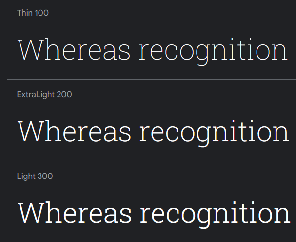
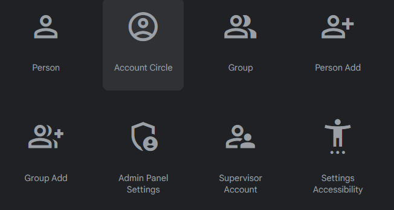

# 🚀Projet LE BON GOUT
## 🔥Présentation 
>Le restaurant "LE BON GOUT" est une expérience culinaire authentique situé à 86 BD PAUL BARRE 78580 MAULE, où l'art de la cuisine prend vie.
Ouvert depuis moins d’un an, notre établissement est spécialisé dans le secteur d'activité de la restauration de type rapide.

## Charte grphique &amp; typographique
  ### Palette couleur

### Typo : Roboto Slab

### Iconographie

Concepteur &amp; réalisateur **Heisenberg Product**

> [Voir la publication](https://giusmili.github.io/projet-resto/)

